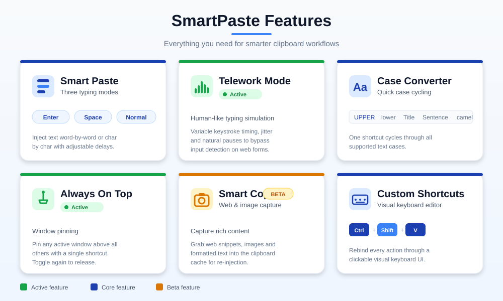
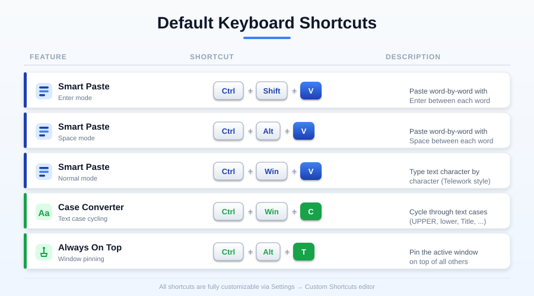
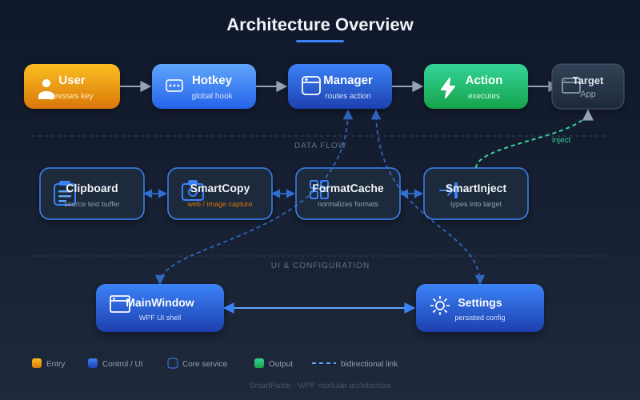

<div align="center">
  
  <h1>SmartPaste</h1>
  <p><strong>A Windows system-tray utility that transforms how you paste, copy, convert, and manage text.</strong></p>

  [](#)
  [](https://dotnet.microsoft.com/download/dotnet/8.0)
  [](LICENSE)
  [](https://github.com/hopenmind/smartpaste/releases)
  [](https://www.hopenmind.com)
</div>

---

## Overview

**SmartPaste** is a lightweight, invisible Windows utility that lives in your system tray and intercepts custom global keyboard shortcuts to perform intelligent clipboard operations. It never steals focus from your active window it just types, copies, converts, and manages text on your behalf.

Whether you're fighting web forms that refuse pasted keyword lists, needing to make automated input look human, or wanting to pin a reference window on top while you work, SmartPaste has you covered.

---

## Features

<div align="center">
  
</div>

### 1. Smart Paste Intelligent List Pasting

Copy a block of text (keywords, tags, lists) and SmartPaste will type it out for you as if a human were doing it. Three modes cover every paste scenario:

| Shortcut (default) | Mode | Behavior |
|---|---|---|
| `Ctrl` + `Shift` + `V` | **Enter mode** | Splits text into items, types each one, then presses `Enter`. Ideal for keyword/tag fields that validate one entry at a time. |
| `Ctrl` + `Alt` + `V` | **Space mode** | Splits text into items, types each one, then presses `Space`. Ideal for inline tag fields. |
| `Ctrl` + `Win` + `V` | **Normal mode** | Types the entire clipboard content character by character. |

**Smart Auto-Splitting Engine** no delimiter configuration required. SmartPaste automatically detects and splits copied text on any of:

`Enter` · `Comma` · `Semicolon` · `Period` · `Colon` · `Slash` · `Backslash` · `Pipe` · `Bullet` · `Middle Dot` · `Tab` · Newline

…plus full-width Unicode variants used in CJK text (`，；：。、｜`). If none are found, it falls back to splitting by spaces.

---

### 2. Telework Mode Realistic Human Typing Simulation

A dedicated engine for producing keystroke patterns that are indistinguishable from a real person typing. Designed to bypass productivity-monitoring software ("bossware"), anti-bot form detectors, and any system that flags instant or perfectly rhythmic input as automated.

Ten independently toggleable options:

| # | Option | Effect |
|---|---|---|
| 1 | **Variable rhythm** | Each keystroke gets a randomized delay, mimicking natural speed fluctuations. |
| 2 | **Micro-pauses** | Occasional longer pauses (300–800 ms) simulate moments of "thinking." |
| 3 | **Flow bursts** | Sudden accelerations where several characters are typed rapidly "being in the zone." |
| 4 | **Breathing pauses** | Longer periodic pauses simulating natural breathing/rest cadence. |
| 5 | **Realistic typos** | Rare chance of typing a wrong letter, pressing `Backspace`, and retyping correctly. |
| 6 | **Caps errors** | Occasional missed or errant `Shift`/`CapsLock` presses, then corrected. |
| 7 | **Double keys** | Occasional duplicated keystrokes, then deleted. |
| 8 | **Cursor navigation** | Simulates arrow-key navigation to fix mistakes mid-stream. |
| 9 | **Auto-correct** | Simulates noticing and self-correcting errors after the fact. |
| 10 | **End-of-line pauses** | Brief pauses at the end of lines/words, as a human would. |

**Configurable parameters:** base delay, chunk size, and breathing interval all adjustable from the **Telework** tab.

---

### 3. Case Converter Instant Case Cycling

**Shortcut:** `Ctrl` + `Win` + `C`

Select any text in any application, press the shortcut, and it cycles through four case modes automatically:

```
lowercase → UPPERCASE → Title Case → aLtErNaTiNg CaSe → back to lowercase
```

Each press advances to the next mode. No menus, no configuration select, press, done.

---

### 4. Always On Top Pin Any Window

**Shortcut:** `Ctrl` + `Alt` + `T`

Click any window to make it active, press the shortcut, and that window stays pinned above all others. Press again to release. Useful for keeping a calculator, reference document, video player, or terminal visible while working in other apps.

---

### 5. Smart Copy `[BETA]` Faithful Web Content Capture

**Shortcut:** `Ctrl` + `Shift` + `C` *(disabled by default enable in the **Beta** tab)*

Copies selected content from web pages and documents while preserving **exact visual fidelity** including rendered math equations, SVG graphics, and images.

**How it works:**
1. Intercepts the clipboard's HTML content after a normal copy.
2. Detects all `` tags (PNG, JPEG, GIF, SVG) and inline `<svg>` elements (commonly used by MathJax for equations).
3. Downloads each image in memory and converts it to a **Base64 data URI**, embedding the image directly inside the HTML.
4. Replaces the original web URLs with these self-contained Base64 blocks.
5. Preserves RTF and plain-text fallbacks for compatibility with simpler editors.

**Result:** Paste into Word, LibreOffice, Notion, or email clients and get the exact visual layout you saw on screen equations render perfectly and images don't break. No more broken LaTeX or missing images when copying from Wikipedia, arXiv, or scientific journals.

> *Experimental feature behavior may change between releases.*

---

### 6. Visual Shortcut Editor

Every shortcut is fully reassignable. Click any shortcut field in the **Shortcuts** tab to open a **virtual keyboard popup**:

- Toggle modifier keys (`Ctrl`, `Alt`, `Shift`, `Win`) visually.
- Click a main key to assign it.
- Built-in **Windows shortcut conflict detection** warns you when a chosen combination is already reserved by the OS.

---

## User Interface

The settings window is organized into six tabs:

| Tab | Purpose |
|---|---|
| **Home** | Landing page with feature cards and quick navigation. |
| **Shortcuts** | View and reassign every shortcut via the virtual keyboard popup. |
| **Telework** | Toggle the 10 human-simulation options and tune delay / chunk / breathing intervals. |
| **Functions** | Enable/disable individual features, set typing speed, and configure startup behavior. |
| **Beta** | Experimental settings for Smart Copy. |
| **About** | Version info, credits, and license details. |

Right-click the **system tray icon** for a quick-access context menu (Settings, pause/resume, exit).

---

## Installation

### Option A Download a Release (recommended)

Pre-built, **self-contained single-file executables** are published on the Releases page. No .NET installation required.

1. Go to the **[Releases](https://github.com/hopenmind/smartpaste/releases)** page.
2. Download the ZIP for your architecture:
   - `SmartPaste-win-x64.zip` Windows 64-bit (Intel/AMD)
   - `SmartPaste-win-arm64.zip` Windows ARM64 (Surface Pro X, Snapdragon laptops)
3. Extract the ZIP anywhere.
4. Run **`SmartPaste.exe`**. The icon appears in your system tray.

> The builds are *self-contained* everything needed to run is bundled inside the single `.exe`. Just download, extract, and run.

### Option B Build from Source

See [Building from Source](#building-from-source) below.

### First Launch

By default, the settings window opens on first launch so you can review all shortcuts and features. Enable **Start minimized to system tray** in the **Functions** tab to skip this on future launches.

---

## Usage Guide

<div align="center">
  
</div>

### Default Keyboard Shortcuts

| Shortcut | Action |
|---|---|
| `Ctrl` + `Shift` + `V` | Smart Paste **Enter mode** (type item + Enter) |
| `Ctrl` + `Alt` + `V` | Smart Paste **Space mode** (type item + Space) |
| `Ctrl` + `Win` + `V` | Smart Paste **Normal mode** (type char by char) |
| `Ctrl` + `Win` + `C` | Case Converter (cycle lower → UPPER → Title → aLtErNaTiNg) |
| `Ctrl` + `Alt` + `T` | Always On Top (pin / unpin active window) |
| `Ctrl` + `Shift` + `C` | Smart Copy `[BETA]` *(disabled by default)* |

> All shortcuts are reassignable from the **Shortcuts** tab.

### Typical Workflows

- **Filling a tag field that rejects pasting** → Copy your keyword list → focus the field → press `Ctrl`+`Shift`+`V`.
- **Making automated typing look human** → Enable Telework Mode options in the **Telework** tab → paste with any Smart Paste shortcut.
- **Copying a Wikipedia equation into Word** → Enable Smart Copy in the **Beta** tab → select content on the page → press `Ctrl`+`Shift`+`C` → paste into Word.
- **Quickly changing text case** → Select text → press `Ctrl`+`Win`+`C` repeatedly until the desired case appears.

### Settings Persistence

All settings are automatically saved to:

```
%LOCALAPPDATA%\SmartPaste\settings.json
```

Your shortcuts, typing speed, simulation preferences, and startup options are preserved between sessions.

---

## Architecture

<div align="center">
  
</div>

SmartPaste is a C# .NET 8 WPF application that relies on Win32 interop for global input interception and simulation.

| Component | Purpose |
|---|---|
| `GlobalHotkey` | Win32 `RegisterHotKey` wrapper for system-wide shortcut interception. |
| `PasteInterceptor` | Low-level keyboard hook (`WH_KEYBOARD_LL`) for paste interception. |
| `SmartPasteManager` | Core paste engine 3 modes, smart splitting, and human simulation. |
| `TargetDetector` | Detects the currently focused window/target for paste operations. |
| `SmartCopyManager` | HTML clipboard interceptor with Base64 image/SVG embedding. |
| `CaseConverterManager` | Text case cycling engine (lower / upper / title / alternating). |
| `AlwaysOnTopManager` | Win32 `SetWindowPos` wrapper for window pinning. |
| `AutoStartManager` | AppData self-copy and Windows Registry startup management. |
| `SettingsManager` | JSON-based settings persistence in `%LOCALAPPDATA%`. |
| `ShortcutParser` | Parses and resolves configurable shortcut combinations. |
| `ContentPackage` | Packages captured Smart Copy content (HTML/RTF/text + embedded images). |

### Tech Stack

| Layer | Technology |
|---|---|
| Language | C# |
| Framework | .NET 8 · WPF |
| System tray | [`Hardcodet.NotifyIcon.Wpf`](https://www.nuget.org/packages/Hardcodet.NotifyIcon.Wpf) 2.0.1 |
| Key simulation | [`InputSimulatorCore`](https://www.nuget.org/packages/InputSimulatorCore) 1.0.5 |
| Global hotkeys | Win32 `RegisterHotKey` via `user32.dll` |
| Paste interception | Low-level keyboard hook (`WH_KEYBOARD_LL`) |
| Window pinning | Win32 `SetWindowPos` |
| Persistence | JSON file in `%LOCALAPPDATA%\SmartPaste\` |

---

## Building from Source

### Requirements

- [**.NET 8 SDK**](https://dotnet.microsoft.com/download/dotnet/8.0)
- **Windows 10 or 11**
- **Visual Studio 2022** *or* the `dotnet` CLI

### Steps

```bash
git clone https://github.com/hopenmind/smartpaste.git
cd smartpaste
dotnet restore
dotnet build
dotnet run
```

The compiled executable is placed in:

```
bin/Debug/net8.0-windows/SmartPaste.exe
```

### Publish a Self-Contained Single File

```bash
# Windows x64
dotnet publish -c Release -r win-x64 --self-contained true -p:PublishSingleFile=true

# Windows ARM64
dotnet publish -c Release -r win-arm64 --self-contained true -p:PublishSingleFile=true
```

Output appears in `bin/Release/net8.0-windows/<RID>/publish/`.

---

## Continuous Delivery

This repository includes a **GitHub Actions** workflow that automatically builds self-contained single-file executables on every release tag for both architectures:

| Asset | Architecture | Runtime |
|---|---|---|
| `SmartPaste-win-x64.zip` | Windows x64 (Intel/AMD) | Self-contained |
| `SmartPaste-win-arm64.zip` | Windows ARM64 | Self-contained |

Users download the ZIP, extract it, and run `SmartPaste.exe` **no .NET installation required**.

---

## Security & Privacy

- SmartPaste runs **entirely locally**. No telemetry, no analytics, no background reporting.
- The only network traffic occurs when **Smart Copy** downloads images from web pages you explicitly copy from nothing else ever leaves your machine.
- Telework Mode uses randomized timing no two paste sessions produce identical keystroke patterns.
- Global keyboard hooks listen **only** for the specific registered shortcut combinations. All other keystrokes pass through untouched.

See [SECURITY.md](SECURITY.md) for the full policy.

---

## Contributing

Contributions, bug reports, and feature requests are welcome. Please read the [**Contributing Guidelines**](CONTRIBUTING.md) before submitting a pull request.

---

## License

**Copyright © 2026 Hope 'n Mind [www.hopenmind.com](https://www.hopenmind.com)**

**All Rights Reserved.** This software is provided **free of charge for personal, non-commercial use only.**

No right of commercial exploitation, redistribution, modification, or creation of derivative works is granted without prior written permission from Hope 'n Mind. See the [LICENSE](LICENSE) file for full terms.

---

<div align="center">
  <strong>Hope 'n Mind</strong><br>
  <a href="https://www.hopenmind.com">www.hopenmind.com</a>
</div>
