

  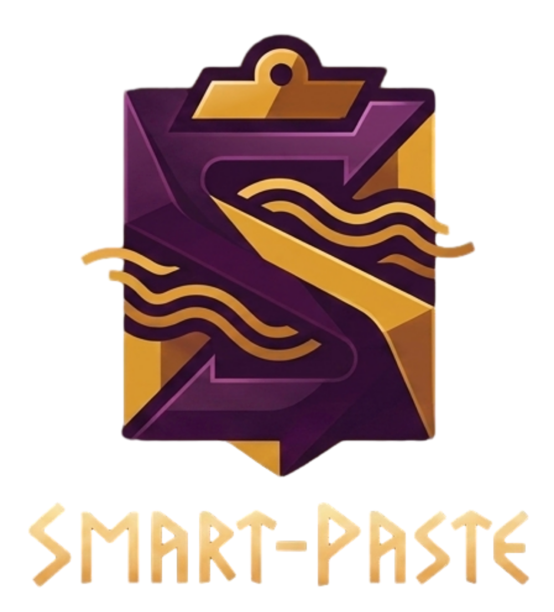

  
  
  
  
  
  

# SmartPaste

A keyboard-first clipboard companion for Windows. Software by Hope 'n Mind.

SmartPaste lives in the system tray. It captures a rich selection once, then pastes the *right* format into whatever application is in front of you: full HTML into browsers and office suites, RTF into WordPad, Markdown into markdown editors, a vector into Inkscape. Images, equations and formatting survive the trip. It is built to preserve meaning, and to state plainly what each target can and cannot keep.

<table>
  <tr>
    <td>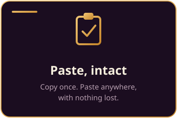</td>
    <td>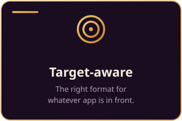</td>
    <td>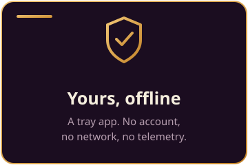</td>
  </tr>
</table>

  

Copy once, and let the target decide nothing. Smart Copy builds a self-contained package of what you selected; on paste, SmartPaste detects the foreground application and hands it the single format it renders best.

  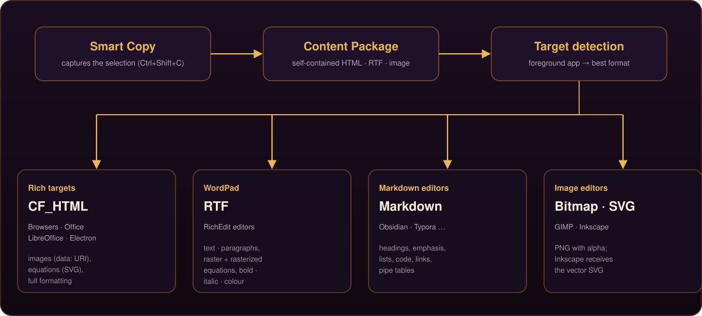

 **One capture, every format.** Smart Copy turns the selection into a self-contained Content Package: each image embedded as a `data:` URI, SVG equations kept as vectors, and a parallel RTF built with `\pict` images. Nothing depends on a link that can break.

 **The target decides nothing.** On paste, the foreground app is detected and given exactly the format it renders best: CF_HTML for browsers, Office, LibreOffice and Electron apps; RTF for WordPad; Markdown for markdown editors; a bitmap or the SVG vector for image editors.

 **Ctrl+V, upgraded.** When a Smart Copy is available, an ordinary Ctrl+V is transparently upgraded to the target-aware paste. When it is not, the keystroke passes straight through, so a normal paste is never swallowed.

A faithful, self-contained copy of the selection, so what you see is what you paste, wherever you paste it.

<table>
  <tr>
    <td>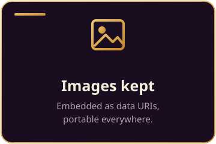</td>
    <td>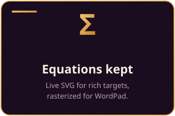</td>
    <td>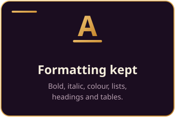</td>
  </tr>
</table>

 **Images travel with the text.** Remote images are fetched with browser-like headers and embedded; `data:` URIs are decoded (tolerant of wrapped or URL-safe base64) and inline SVG is inlined. The copied HTML is fully self-contained, so browsers, mail clients and Electron apps that reject file references still render every image.

 **Equations survive.** A MathJax or KaTeX equation stays a live SVG vector for rich targets, and is rasterized to PNG for RTF and bitmap targets, so it reaches WordPad and image editors as an image rather than vanishing.

 **Formatting is preserved, honestly.** Semantic HTML (bold, italic, underline, headings, colour, lists, tables) is carried into RTF for RTF-only editors; formatting expressed only through inline CSS reaches the rich targets through CF_HTML. Transparency is kept by reading the alpha-preserving clipboard image where an app provides it. *In practice: copy a Wikipedia section with an equation and paste it into an email or LibreOffice, image and maths intact.*

Fill a whole form from a single paste, drop the right format into any target, or type it out like a human when a field refuses a paste at all.

  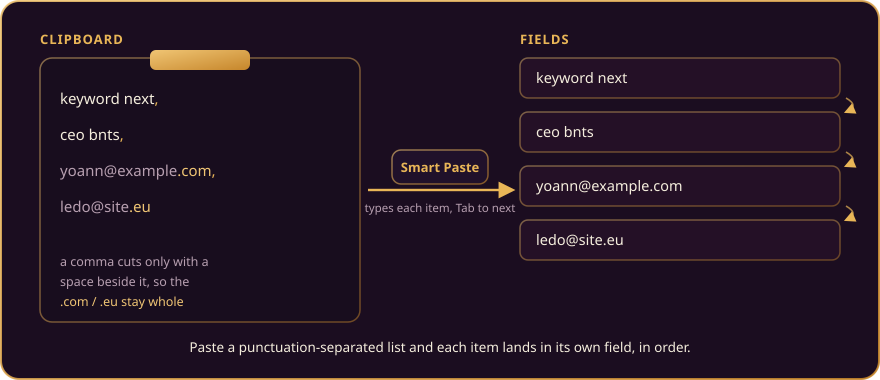

 **Fill fields from a list.** Paste a punctuation-separated list (`keyword next, ceo bnts, yoann@example.com, ledo@site.eu`) and SmartPaste types each item into its own field, pressing Tab between them. A delimiter cuts an item only when a space sits beside it, so `yoann@example.com` and `ledo@site.eu` are never split on their dots. *In practice: fill a tag box, a recipients row, or a spreadsheet line from one clipboard.*

 **Target-aware paste.** Three bindings paste the captured content the way the target wants it, with no manual "paste special". *In practice: paste a formatted table into Word, and the very same copy as clean Markdown into Obsidian.*

 **Human-rhythm typing.** For fields that block paste (secure inputs, some web forms, remote sessions), Telework types the text with a natural cadence: variable rhythm, micro-pauses, flow bursts, breathing pauses, and optional realistic corrections.

 **Type from a file.** Load a document and Telework types its content, with a small always-on-top panel in front of the target so a run stops instantly with the red Stop button or the Escape key. *In practice: fill a legacy app that refuses paste, straight from a `.txt`.*

 **Case Converter.** Cycle the selection through lower, UPPER, and Title case with a single shortcut. *In practice: fix a heading pasted in ALL CAPS to Title case in place, without retyping.*

 **Always On Top.** Pin the active window above the others, and release it, without hunting through a menu. *In practice: keep a reference PDF or a video pinned while you work in another app.*

One window, keyboard-first, and a system-tray twin that can run the whole app on its own. The dashboard puts the four core functions a hover away around a radial wheel; every switch, brand and shortcut also lives in the tray menu.

<table>
  <tr>
    <td align="center" valign="middle" width="38%">
        
      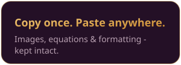
    </td>
    <td align="center" valign="middle" width="62%">
      
    </td>
  </tr>
</table>

 **A wheel, not a menu.** The four core functions sit around a radial wheel. Hover a quadrant to configure it, while a locked centre holds your choice as you reach the options, so a function never deselects itself when the pointer drifts.

 **The whole app, from the tray.** The same controls live in the system-tray menu: a pill switch for each function, colour swatches to pick a brand, and Telework and Shortcuts as submenus. Shortcuts can be rebound from the tray without ever opening the window.

  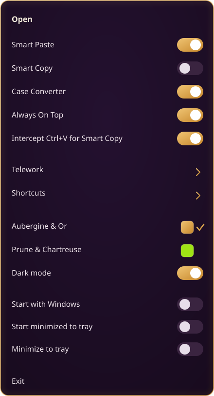

 **Two brands, light and dark.** Switch between the Aubergine and Prune palettes, and between light and dark, from either surface; the choice applies live across the window and the tray. Start with Windows, start minimized, and minimize to tray are one toggle each.

Download the latest build and run it. Everything is self-contained: no separate .NET runtime is required.

  

That is all most people need. If you would rather run a portable build with no installer, these download directly from the latest release:

| Portable build | Download |
|---|---|
| Windows x64 | [SmartPaste-win-x64.zip](https://github.com/hopenmind/SmartPaste/releases/latest/download/SmartPaste-win-x64.zip) |
| Windows ARM64 | [SmartPaste-win-arm64.zip](https://github.com/hopenmind/SmartPaste/releases/latest/download/SmartPaste-win-arm64.zip) |

Every build is also on the [release page](../../releases/latest). SmartPaste starts in the system tray; double-click the tray icon to open the dashboard, or right-click it for options.

To build from source, install the **.NET 8 SDK** on Windows 10 or 11 and run `dotnet build -c Release SmartPaste/core/SmartPaste.csproj`. The self-contained bundles and the installer are produced by the release workflow on a version tag (see [`.github/workflows/build.yml`](.github/workflows/build.yml) and [`SmartPaste/installer/SmartPaste.iss`](SmartPaste/installer/SmartPaste.iss)).

SmartPaste preserves what it can and names what it cannot.

 **Windows only, by design.** SmartPaste is a WPF application built on Win32 clipboard formats, a low-level keyboard hook, global hotkeys and system-tray integration. The .NET 8 runtime is cross-platform, but this UI and its OS hooks are not, so there is no macOS or Linux build.

 **WordPad reads RTF, not CF_HTML.** Semantic formatting is preserved in RTF; formatting expressed only through inline CSS (for example ``) reaches the rich targets through CF_HTML but is not reconstructed in RTF.

 **Equations become images off the web.** They are kept as live SVG for rich targets and rasterized for RTF and bitmap targets, so they survive as images, not as editable vectors, in those places.

 **Some shortcuts belong to Windows.** Combinations the OS reserves (for example `Win+V`) cannot be rebound; the editor flags them by name.

 **Unreachable images are left as they are.** A remote image behind a login or an offline network is kept as its original reference rather than guessed at.

 [SECURITY](SECURITY.md): the security policy and how to report an issue.

 [CONTRIBUTING](CONTRIBUTING.md): how contributions are handled.

 [LICENSE](LICENSE): all rights reserved. Free for personal, non-commercial use.

 

  

Made by <b>Hope 'n Mind</b>

